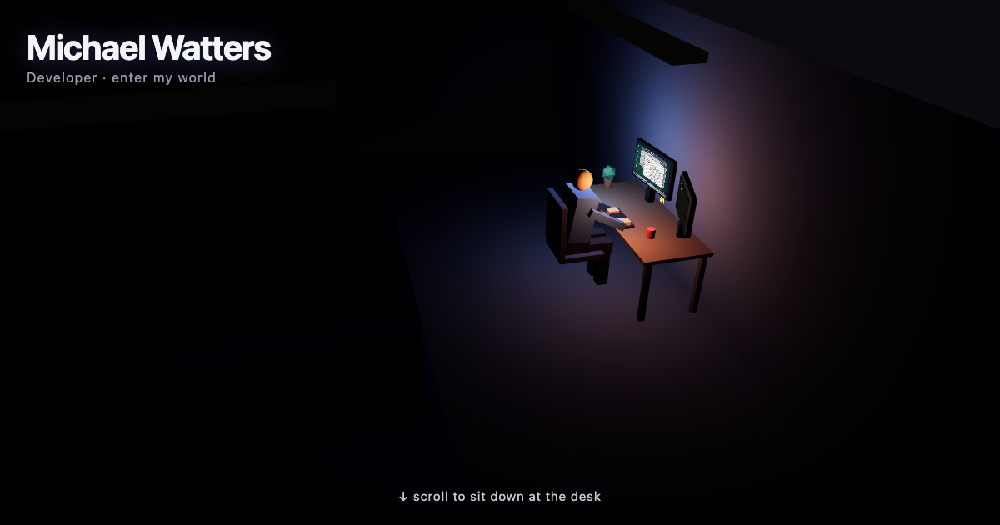

# the night garage 🌃

**A portfolio you can walk around in — and drive.**
Live at **[michaeljohnwatters.github.io](https://michaeljohnwatters.github.io)**



Scroll in and you spiral down into a night-time workshop, landing at a desk
with two working monitors running a retro OS. Read the CV, browse the *real*
web on an in-world browser, chat with the garage terminal — then step away
from the desk and the place becomes a small open world: flip the lights,
roll up the garage doors, sit on the sofa and cast YouTube to the big TV
from an in-game phone (it's passcode-locked; the code is on a post-it),
then take the Civic or a motorbike out for a night drive around the lot.

Everything is code: procedural low-poly geometry, synthesized WebAudio
(zero sound files), canvas-drawn wall art. Built by
[Michael Watters](https://www.linkedin.com/in/michael-watters-b50437167)
— Scala engineer by day, this by night.

## The interesting engineering bits

- **Screens on glass** — the retro OS is real DOM, projected onto the 3D
  monitors with drei's `<Html transform occlude="blending">`: the UI sits
  *behind* a transparent WebGL canvas, and depth-punch meshes cut per-pixel
  holes so 3D objects correctly occlude it. The night sky is the same trick
  inverted — the day/night sky is literally the page's CSS background.
- **A raycast input bridge** — R3F pointer events die in this stack, so a
  manual `THREE.Raycaster` maps window pointer events → screen UV →
  framebuffer coordinates and fires real DOM clicks/drags. One retro cursor
  travels between monitors; in first person the crosshair is the pointer.
  Physical props (switches, TV, doors, phone) have per-prop reach limits.
- **Real web search, in-world** — a Cloudflare Worker proxies search and
  even full pages server-side (where `X-Frame-Options` can't reach),
  rewrites links back through itself, and flags blocked sites so the
  browser shows a native "won't let us in" notice. YouTube search powers
  the phone's cast app; live-stream IDs are resolved fresh so they never
  go stale.
- **All audio is synthesized** — clicks, key clacks, footsteps, the door
  motor, engine (pitch follows speed), the two-tone horn: WebAudio
  oscillators and filtered noise. No audio files exist in this repo.
- **A cannon-es physics playground** (the Bruno Simon special) — the lot
  is scattered with proper rigid bodies: drive through **MICHAEL** in big
  tumbling letters, scatter the cones, flatten the bins, bowl the 10-pin
  corner. The hand-rolled vehicle sim stays in charge of driving; vehicles
  and the walker enter the physics world as kinematic pushers, and impact
  thuds are synthesized from collision velocity.
- **Vehicles are a tiny kinematic sim with a simulated gearbox** — a
  5-speed with a torque curve, auto-shifting engine note, and a real
  clutch: hold it to free-rev to the limiter and drop it for a wheelspin
  launch (synthesized tyre screech and all). Speed-scaled steering, bikes
  lean ~43° into corners (the first-person camera leans with them), one
  spotlight headlight beam on the driven vehicle, and everything collides
  with the building, each other, and you.
- **Verification harness** — `scripts/*.mjs` drive the site headlessly
  (walk, sit, unlock the phone, open doors, drive out) and capture
  screenshots + FPS probes. 60fps is the bar.

## Controls

| Where | Keys |
|---|---|
| Desk | scroll to dive · click/type the OS · `1`/`2` lean in, `3`/Esc back · click post-its to read |
| On foot | `WASD` walk · mouse look · `E` sit/ride/drive · `P` phone · `L` lights |
| Driving | `WASD` drive · `⇧` clutch · `↑`/`↓` gears · `V` cam · `F` flash · `H` horn · `E` out |
| Anywhere | 💡 lights · ☀️ day/night · 🔊 mute |

## Develop

Requires **Node 20** (`nvm use 20`).

```bash
npm install     # first time only
npm run dev     # local dev server
npm run build   # production build -> dist/
npm run preview # preview the production build
```

## Deploy

Pushes to `main` auto-deploy via GitHub Actions → GitHub Pages. The search
worker lives in [`worker/`](./worker/) (Cloudflare, free tier). Full project
notes in [`CLAUDE.md`](./CLAUDE.md), roadmap in [`TODO.md`](./TODO.md).
